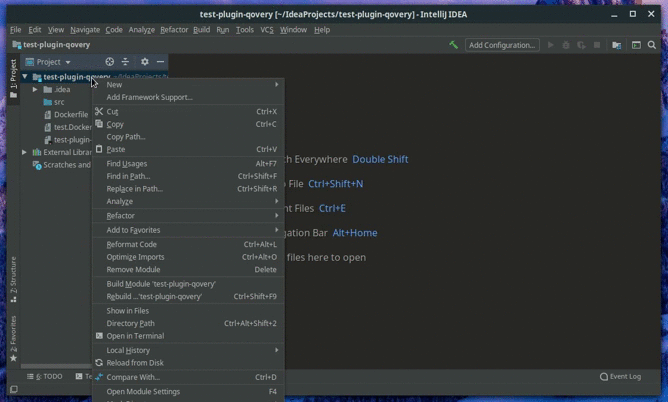

# Qovery Plugin
Qovery Plugin makes it easy to edit Qovery yaml specification files inside IntelliJ based products. You will soon be able to find it on jetbrains!

## Demo 

## Usage
Open a file that end with .qovery.yml :)

## Compatibility
This plugin is tested in version `2018.2.7` of intellij and `2019.3.4`.

